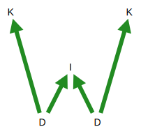

# KTS: Knowledge Transformation System

implementation in Javascript for node.js (CLI), Atlassian Forge, Observable and static-website target environments

KTS stands for "Knowledge Transformation System". It is a collection of tools for creating, moving, linking, re-shaping, **visualizing and exploring** information.

## What is the current scope of KTS?

KTS currently has tools for end-to-end processing of Jira issues into interactive SVG diagrams (*Value Maps*).

KTS can produce stand-alone SVG Value Maps, e.g. for hosting in a file system or on a static website.

KTS also contains a Jira app which shows such *Value Maps* inside the Jira cloud instance.

Another (shorter) production workflow is to generate *Value Maps* from handcoded DOT (GraphViz) source files.
